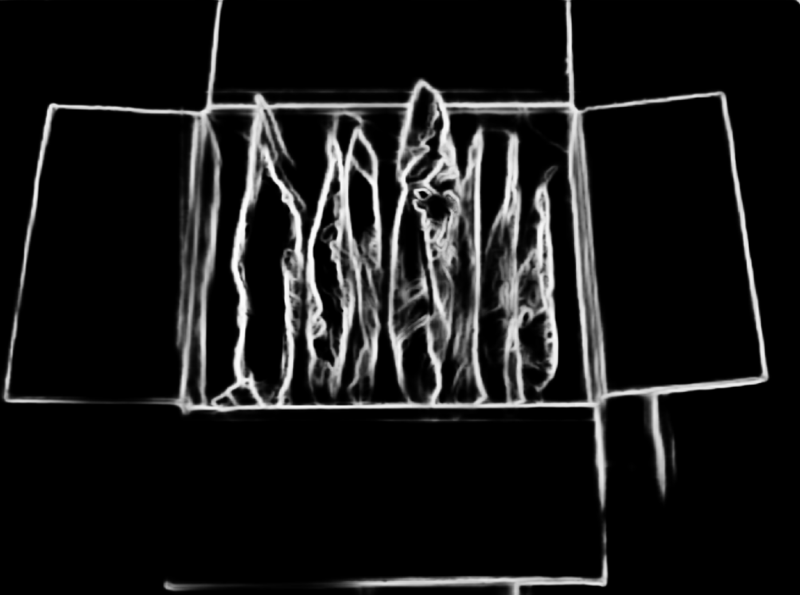

# Deep Learning based Edge Detection ROS.

Detect edge usinig HED(Holistically-Nested Edge Detection) Deep Neural Network.  
The original paper is [here][2] and I cited codes of [CV-Tricks.com][1]  

[1]:https://cv-tricks.com/opencv-dnn/edge-detection-hed/
[2]: https://arxiv.org/abs/1504.06375
